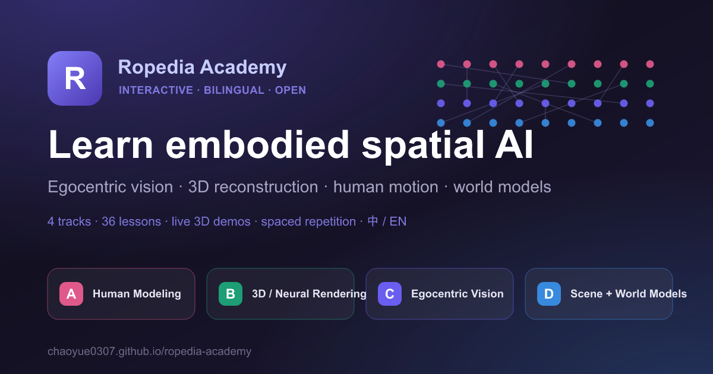

<p align="center">
  <a href="https://chaoyue0307.github.io/ropedia-academy/">
    
  </a>
</p>

<h1 align="center">Ropedia Academy</h1>

<p align="center">
  <a href="https://chaoyue0307.github.io/ropedia-academy/"><b>🌐 Live demo</b></a> ·
  4 tracks · 36 bilingual lessons · live 3D demos · spaced repetition
</p>

An interactive, bilingual (中文 / English) course on embodied & spatial AI —
four connected tracks covering **human modeling & motion**, **3D/4D
reconstruction & neural rendering**, **egocentric vision & interaction**, and
**scene reconstruction & world models**.

Read lessons, play with live interactive demos (including real-time 3D),
self-test with reveal-answer checks, see how everything connects on a concept
map, and review with spaced repetition. Runs entirely in the browser — no
account required.

  

## Features

- **4 tracks · 36 lessons**, each with a bilingual explanation, key terms, key
  papers, external links, cross-track links, and self-check questions with
  standard answers.
- **Interactive demos** — 13 hands-on visualizations, including real-time
  **three.js 3D** (Gaussian splatting, a raymarched NeRF volume, an articulated
  SMPL body) and explorable diagrams (pinhole projection, TSDF fusion, SLAM
  loop closure, action anticipation, and more).
- **Bilingual reading** — switch 中文 / English / 双语 (side-by-side) anywhere.
- **Math & code** — KaTeX formulas and a focused Python/PyTorch snippet in every
  lesson (soft-argmax, 6D rotations, NeRF volume rendering, TSDF fusion, world-model
  rollouts, …), each with one-click **[Open in Colab](notebooks/)** to run it — no
  install, no login to read.
- **Self-graded checks & quiz mode** — reveal standard answers, or take a
  per-track quiz with scoring.
- **Spaced repetition** — add any check to a review deck; an SM-2 scheduler
  surfaces due cards, with a 7-day forecast.
- **Concept map** — see how lessons connect across tracks; hover to trace links.
- **Progress tracking** — a mastery map, per-track rings, “continue”, and a
  ⌘K command palette + searchable glossary.
- **Light / dark theme**, mobile-friendly, **local-first** (no account required).

## Run locally

```bash
npm install
npm run dev      # http://localhost:5173
```

Build for production:

```bash
npm run build    # outputs to dist/
npm run preview  # preview the production build
```

## Deploy

It's a static SPA — deploy `dist/` anywhere (Vercel, Netlify, GitHub Pages,
Cloudflare Pages). On Vercel: import the repo, framework preset **Vite**, build
command `npm run build`, output `dist`. Add the optional env vars below for
login.

## Optional: easy login + cross-device sync (Supabase)

The app runs fully without an account (local mode). To enable **Google /
magic-link login** and sync progress across devices, create a free
[Supabase](https://supabase.com) project and set:

```bash
# .env (copy from .env.example)
VITE_SUPABASE_URL=https://YOUR-PROJECT.supabase.co
VITE_SUPABASE_ANON_KEY=YOUR-ANON-KEY
```

When these are present the app shows a “synced” badge; when absent it stays in
local mode. (Auth UI is not wired yet — the client is scaffolded in
`src/lib/supabase.ts`.)

## Project structure

```
src/
  lib/
    types.ts            content model (Track, Lesson, CheckQuestion, …)
    curriculum/         the 4 tracks × 9 lessons (trackA..D) + index helpers
                        + lessonCode.ts (per-lesson Python/PyTorch snippets)
    store.ts            zustand store, local-first persistence
    srs.ts              SM-2 spaced-repetition scheduler
    i18n.ts             UI strings (中/EN)
    supabase.ts         optional auth client (env-gated)
  components/           Layout, Markdown, BiText, CheckCard, command palette,
                        mastery map, figures/ (interactive demos incl. three/ 3D)
  pages/                Dashboard, Overview, Track, Lesson, Quiz, Review,
                        Concept map, Glossary, Settings
notebooks/              one Colab-ready .ipynb per lesson (generated)
scripts/
  gen-notebooks.mjs     regenerates notebooks/ from lessonCode.ts
  gen-og.mjs            regenerates the social card (public/og.png)
```

## Editing or extending content

All content lives in `src/lib/curriculum/track{A,B,C,D}.ts` as plain typed
objects. To add a lesson, append a `Lesson` to a track's `lessons` array; to add
a track, create a new file and register it in `src/lib/curriculum/index.ts`.
Lesson bodies are Markdown with `$math$` and fenced code. No CMS, no build step
beyond Vite — edit, save, hot-reload.

Per-lesson code examples live in `src/lib/curriculum/lessonCode.ts` (a
`lessonId → { code, note }` map). After editing them, run `npm run gen-notebooks`
to regenerate the matching Colab notebooks in `notebooks/` — the snippet, the
lesson page, and the notebook all come from that one file.

## Roadmap

Optional next steps: an **AI tutor** (bring-your-own LLM API key) for
ask-anything Q&A and free-answer grading, and a hands-on reproduction workbench.
