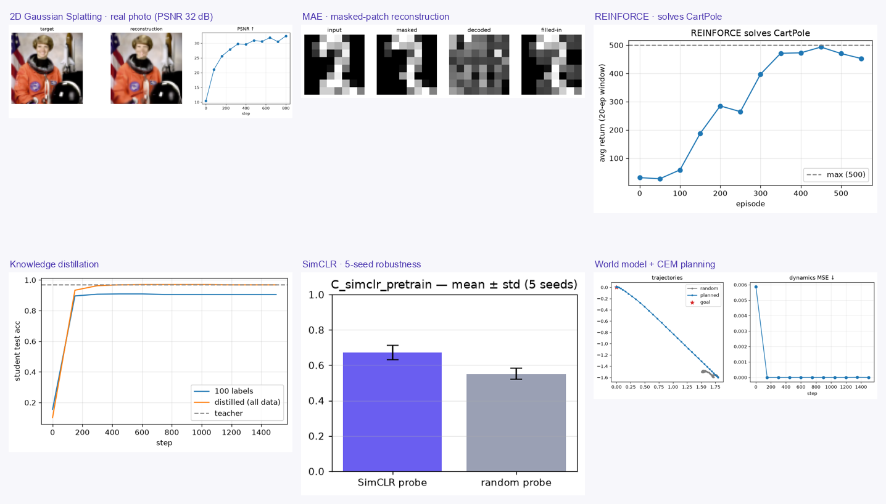

<p align="center">
  <a href="https://chaoyue0307.github.io/ropedia-academy/">
    
  </a>
</p>

<h1 align="center">Ropedia Academy</h1>

<p align="center">
  <a href="https://chaoyue0307.github.io/ropedia-academy/"><b>🌐 Live site</b></a> ·
  4 tracks · 36 bilingual lessons · live 3D demos · spaced repetition
</p>

An interactive, bilingual (中文 / English) course on embodied & spatial AI — four
connected tracks covering **human modeling & motion**, **3D/4D reconstruction &
neural rendering**, **egocentric vision & interaction**, and **scene
reconstruction & world models**. Read lessons, play with live interactive demos
(including real-time 3D), run the code in Colab, self-test, and review with
spaced repetition. Runs entirely in the browser — no account required.

  

## Features

- **4 tracks · 36 lessons**, each with a bilingual explanation, key terms, key
  papers, external links, cross-track links, and self-check questions.
- **An interactive demo in every lesson** — real-time **three.js 3D** (Gaussian
  splatting, a raymarched NeRF volume, an articulated SMPL body) plus explorable
  diagrams (triangulation, bundle adjustment, rotation continuity, hash grids,
  TSDF fusion, SLAM loop closure, reference frames, world-model rollouts, …).
- **Math & code** — KaTeX formulas and a runnable Python/PyTorch snippet per
  lesson, each with one-click **Open in Colab**; its real output (printed values
  + figure) shows inline behind a *predict-it, then reveal* toggle.
- **Bilingual reading** (中文 / English / 双语) and **hover-to-define** glossary
  tooltips on foundational terms.
- **Self-graded checks & quiz mode**, **spaced repetition** (SM-2) with a 7-day
  forecast, a cross-track **concept map**, progress tracking, and a ⌘K palette.
- **Light / dark theme**, mobile-friendly, **local-first** (no account required).

## Training labs

Beyond the per-lesson snippets, [`notebooks/training/`](notebooks/training/) holds
**twenty-three real, multi-cell Colab notebooks you can actually train** — split into
clear blocks (data · model · train · compare) so you can step through and watch
each stage:

| Track | From scratch (PyTorch) | Foundation model |
|---|---|---|
| **A · Human** | SMPLify body fit · motion diffusion (DDPM) · 2D pose (heatmap) · 6D vs Euler rotation | — |
| **B · 3D / rendering** | NeRF (`tiny_nerf`) · neural SDF · 2D Gaussian Splatting · hash grid (Instant-NGP) · ICP registration · MAE pretraining | — |
| **C · Egocentric** | action anticipation (LSTM) · SimCLR self-supervised pretraining | CLIP probe · fine-tune VideoMAE · DINOv2 features |
| **D · Scene / world** | world model + planning (MPC) · TSDF fusion → mesh · Bayesian semantic mapping | — |
| **LM · Language** | a GPT from scratch (nanoGPT) · knowledge distillation | — |
| **AG · Agents & RL** | REINFORCE policy gradient · behavior cloning · agent + tool-use harness | — |

The twenty self-contained PyTorch labs are **verified to train** (each was run
to confirm loss drops / PSNR climbs / metrics beat chance); the three foundation
labs follow the official APIs and run on a Colab GPU. Every lab records its
checkpoint + loss/eval history + figures to a downloadable `outputs/<lab>/`, and an
optional cell **publishes the run to the Hugging Face Hub** (a model repo with a
metrics-and-plot model card) so you can gather them into a Collection. Open them from the dashboard's **Training labs** section, or see
[`notebooks/training/README.md`](notebooks/training/README.md) for one-click Colab
badges. Set **Runtime → T4 GPU** first.

### Advanced labs (heavy · real repos · GPU)

[`notebooks/advanced/`](notebooks/advanced/) adds **twenty-two heavy GPU pipelines** on
real research repos for when you want the production tools, not a teaching toy:

| Track | Advanced pipelines |
|---|---|
| **A · Human** | MDM text-to-motion · 4D-Humans (HMR 2.0) mesh-from-video |
| **B · 3D / rendering** | 3D Gaussian Splatting (CUDA) · Nerfstudio nerfacto |
| **C · Egocentric** | VideoMAE fine-tune on EPIC/Ego4D · SAM 2 video segmentation · Whisper ASR fine-tune |
| **D · Scene / world** | SplaTAM (Gaussian SLAM) · DreamerV3 world model |
| **LM · Language & multimodal** | QLoRA · DPO · VLM fine-tune · Video-LM · RAG · LLM eval · Unsloth · RLHF (PPO) · Stable Diffusion LoRA · ControlNet · vLLM serving |
| **AG · Agents & RL** | LLM agent (tool use / ReAct) · Habitat embodied navigation |

The verified self-contained labs were each run to confirm real results; the
advanced labs follow each project's official recipe and run on a Colab GPU (some
need gated data), so they are flagged as **not pre-executed**. Every lab records
its checkpoints / loss-eval history / outputs to a downloadable folder, **every lab
cross-links to its related tracks** (chips + filters + an in-notebook note), and the
**Labs** tab closes with a **Future explore directions** board — open cross-track
projects that combine the labs.

These clone official repos, download multi-GB checkpoints/datasets, and **require a
GPU** — they're authored to each project's documented recipe and are **not
pre-executed** (expect to pin a version or two). See the dashboard's **Advanced
labs · GPU** section or [`notebooks/advanced/README.md`](notebooks/advanced/README.md).

## Models on Hugging Face

Every lab publishes to the Hub as a model repo with a full card (base model ·
objective · dataset · config · evaluation · inference · limitations · failure
cases · license · citation · reproducibility), gathered into one Collection. Try
them all live in a single Space.

[](https://huggingface.co/spaces/cy0307/ropedia-demos)
[](https://huggingface.co/cy0307)

The **[🚀 demos Space](https://huggingface.co/spaces/cy0307/ropedia-demos)** runs real
models per task: a small instruct **LLM** (chat · next-action · ReAct tool use), a
class-conditional **DDPM** that generates digits, a **CartPole** agent, and a
world-model **CEM** planner — plus a gallery of every trained model's figure + metrics.

<p align="center"></p>

<!-- MODELS-INDEX:START -->
_19 trained · 26 documented placeholders · 45 repos total — one click trains a placeholder into a real model._


**A · Human modeling & motion**

| Model | Status | Headline result | Links |
|---|---|---|---|
| 2D pose estimation (heatmap regression) | ✅ trained | PCK 0.396 | [🤗](https://huggingface.co/cy0307/ropedia-a-pose-heatmap) · [▶](https://colab.research.google.com/github/ChaoYue0307/ropedia-academy/blob/main/notebooks/training/A_pose_heatmap.ipynb) |
| 4D-Humans (HMR 2.0) — mesh from video | 🚧 placeholder | _pending (GPU)_ | [🤗](https://huggingface.co/cy0307/ropedia-a-4dhumans-mesh) · [▶](https://colab.research.google.com/github/ChaoYue0307/ropedia-academy/blob/main/notebooks/advanced/A_4dhumans_mesh.ipynb) |
| 6D vs Euler rotation regression | ✅ trained | geodesic err 0.0126 | [🤗](https://huggingface.co/cy0307/ropedia-a-rotation-6d) · [▶](https://colab.research.google.com/github/ChaoYue0307/ropedia-academy/blob/main/notebooks/training/A_rotation_6d.ipynb) |
| MDM — text-to-motion | 🚧 placeholder | _pending (GPU)_ | [🤗](https://huggingface.co/cy0307/ropedia-a-mdm-text-to-motion) · [▶](https://colab.research.google.com/github/ChaoYue0307/ropedia-academy/blob/main/notebooks/advanced/A_mdm_text_to_motion.ipynb) |
| Motion diffusion (DDPM) | ✅ trained | final loss 0.159 | [🤗](https://huggingface.co/cy0307/ropedia-a-motion-diffusion) · [▶](https://colab.research.google.com/github/ChaoYue0307/ropedia-academy/blob/main/notebooks/training/A_motion_diffusion.ipynb) |
| SMPLify body fit | ✅ trained | reproj err 6.3e-05 | [🤗](https://huggingface.co/cy0307/ropedia-a-smplify-fit) · [▶](https://colab.research.google.com/github/ChaoYue0307/ropedia-academy/blob/main/notebooks/training/A_smplify_fit.ipynb) |


**B · 3D / 4D & neural rendering**

| Model | Status | Headline result | Links |
|---|---|---|---|
| 2D Gaussian Splatting | ✅ trained | PSNR 32.5 | [🤗](https://huggingface.co/cy0307/ropedia-b-gaussian-splatting-2d) · [▶](https://colab.research.google.com/github/ChaoYue0307/ropedia-academy/blob/main/notebooks/training/B_gaussian_splatting_2d.ipynb) |
| 3D Gaussian Splatting | 🚧 placeholder | _pending (GPU)_ | [🤗](https://huggingface.co/cy0307/ropedia-b-gaussian-splatting-3d) · [▶](https://colab.research.google.com/github/ChaoYue0307/ropedia-academy/blob/main/notebooks/advanced/B_gaussian_splatting_3d.ipynb) |
| ICP point-cloud registration | ✅ trained | RMSE 0.0124 | [🤗](https://huggingface.co/cy0307/ropedia-b-icp-registration) · [▶](https://colab.research.google.com/github/ChaoYue0307/ropedia-academy/blob/main/notebooks/training/B_icp_registration.ipynb) |
| Masked Autoencoder (MAE) | ✅ trained | test MSE 0.136 | [🤗](https://huggingface.co/cy0307/ropedia-b-mae-pretrain) · [▶](https://colab.research.google.com/github/ChaoYue0307/ropedia-academy/blob/main/notebooks/training/B_mae_pretrain.ipynb) |
| Multiresolution hash grid (Instant-NGP) | ✅ trained | PSNR 64.2 | [🤗](https://huggingface.co/cy0307/ropedia-b-hashgrid-instngp) · [▶](https://colab.research.google.com/github/ChaoYue0307/ropedia-academy/blob/main/notebooks/training/B_hashgrid_instngp.ipynb) |
| NeRF from scratch (tiny_nerf) | 🚧 placeholder | _pending (GPU)_ | [🤗](https://huggingface.co/cy0307/ropedia-b-nerf-from-scratch) · [▶](https://colab.research.google.com/github/ChaoYue0307/ropedia-academy/blob/main/notebooks/training/B_nerf_from_scratch.ipynb) |
| Nerfstudio nerfacto | 🚧 placeholder | _pending (GPU)_ | [🤗](https://huggingface.co/cy0307/ropedia-b-nerfstudio-nerfacto) · [▶](https://colab.research.google.com/github/ChaoYue0307/ropedia-academy/blob/main/notebooks/advanced/B_nerfstudio_nerfacto.ipynb) |
| Neural SDF (DeepSDF-style) | ✅ trained | L1 err 0.016 | [🤗](https://huggingface.co/cy0307/ropedia-b-deepsdf-shape) · [▶](https://colab.research.google.com/github/ChaoYue0307/ropedia-academy/blob/main/notebooks/training/B_deepsdf_shape.ipynb) |


**C · Egocentric vision**

| Model | Status | Headline result | Links |
|---|---|---|---|
| Action anticipation (LSTM) | ✅ trained | top-1 0.529 | [🤗](https://huggingface.co/cy0307/ropedia-c-action-anticipation-lstm) · [▶](https://colab.research.google.com/github/ChaoYue0307/ropedia-academy/blob/main/notebooks/training/C_action_anticipation_lstm.ipynb) |
| CLIP: zero-shot vs. probe | 🚧 placeholder | _pending (GPU)_ | [🤗](https://huggingface.co/cy0307/ropedia-cd-clip-zeroshot-probe) · [▶](https://colab.research.google.com/github/ChaoYue0307/ropedia-academy/blob/main/notebooks/training/CD_clip_zeroshot_probe.ipynb) |
| DINOv2 features + probe | 🚧 placeholder | _pending (GPU)_ | [🤗](https://huggingface.co/cy0307/ropedia-c-dinov2-features-probe) · [▶](https://colab.research.google.com/github/ChaoYue0307/ropedia-academy/blob/main/notebooks/training/C_dinov2_features_probe.ipynb) |
| Fine-tune VideoMAE | 🚧 placeholder | _pending (GPU)_ | [🤗](https://huggingface.co/cy0307/ropedia-c-videomae-finetune) · [▶](https://colab.research.google.com/github/ChaoYue0307/ropedia-academy/blob/main/notebooks/training/C_videomae_finetune.ipynb) |
| SAM 2 — video segmentation | 🚧 placeholder | _pending (GPU)_ | [🤗](https://huggingface.co/cy0307/ropedia-c-sam2-video-segmentation) · [▶](https://colab.research.google.com/github/ChaoYue0307/ropedia-academy/blob/main/notebooks/advanced/C_sam2_video_segmentation.ipynb) |
| SimCLR self-supervised pretraining | ✅ trained | probe acc 0.683 | [🤗](https://huggingface.co/cy0307/ropedia-c-simclr-pretrain) · [▶](https://colab.research.google.com/github/ChaoYue0307/ropedia-academy/blob/main/notebooks/training/C_simclr_pretrain.ipynb) |
| VideoMAE — egocentric fine-tune | 🚧 placeholder | _pending (GPU)_ | [🤗](https://huggingface.co/cy0307/ropedia-c-videomae-egocentric) · [▶](https://colab.research.google.com/github/ChaoYue0307/ropedia-academy/blob/main/notebooks/advanced/C_videomae_egocentric.ipynb) |
| Whisper — fine-tune ASR | 🚧 placeholder | _pending (GPU)_ | [🤗](https://huggingface.co/cy0307/ropedia-c-whisper-finetune) · [▶](https://colab.research.google.com/github/ChaoYue0307/ropedia-academy/blob/main/notebooks/advanced/C_whisper_finetune.ipynb) |


**D · Scene & world models**

| Model | Status | Headline result | Links |
|---|---|---|---|
| Bayesian semantic mapping | ✅ trained | map acc 1 | [🤗](https://huggingface.co/cy0307/ropedia-d-semantic-mapping) · [▶](https://colab.research.google.com/github/ChaoYue0307/ropedia-academy/blob/main/notebooks/training/D_semantic_mapping.ipynb) |
| DreamerV3 — world-model RL | 🚧 placeholder | _pending (GPU)_ | [🤗](https://huggingface.co/cy0307/ropedia-d-dreamerv3-world-model) · [▶](https://colab.research.google.com/github/ChaoYue0307/ropedia-academy/blob/main/notebooks/advanced/D_dreamerv3_world_model.ipynb) |
| SplaTAM — Gaussian-Splatting SLAM | 🚧 placeholder | _pending (GPU)_ | [🤗](https://huggingface.co/cy0307/ropedia-d-splatam-slam) · [▶](https://colab.research.google.com/github/ChaoYue0307/ropedia-academy/blob/main/notebooks/advanced/D_splatam_slam.ipynb) |
| TSDF fusion → mesh | ✅ trained | mesh verts 27362 | [🤗](https://huggingface.co/cy0307/ropedia-d-tsdf-fusion) · [▶](https://colab.research.google.com/github/ChaoYue0307/ropedia-academy/blob/main/notebooks/training/D_tsdf_fusion.ipynb) |
| World model + planning (CEM) | ✅ trained | dyn MSE 8.76e-08 | [🤗](https://huggingface.co/cy0307/ropedia-d-world-model) · [▶](https://colab.research.google.com/github/ChaoYue0307/ropedia-academy/blob/main/notebooks/training/D_world_model.ipynb) |


**LM · Language & multimodal**

| Model | Status | Headline result | Links |
|---|---|---|---|
| ControlNet — conditional diffusion | 🚧 placeholder | _pending (GPU)_ | [🤗](https://huggingface.co/cy0307/ropedia-lm-controlnet) · [▶](https://colab.research.google.com/github/ChaoYue0307/ropedia-academy/blob/main/notebooks/advanced/LM_controlnet.ipynb) |
| DPO — align an LLM | 🚧 placeholder | _pending (GPU)_ | [🤗](https://huggingface.co/cy0307/ropedia-lm-dpo-alignment) · [▶](https://colab.research.google.com/github/ChaoYue0307/ropedia-academy/blob/main/notebooks/advanced/LM_dpo_alignment.ipynb) |
| Evaluate an LLM (lm-eval-harness) | 🚧 placeholder | _pending (GPU)_ | [🤗](https://huggingface.co/cy0307/ropedia-lm-eval-harness) · [▶](https://colab.research.google.com/github/ChaoYue0307/ropedia-academy/blob/main/notebooks/advanced/LM_eval_harness.ipynb) |
| Fine-tune a VLM (vision-language) | 🚧 placeholder | _pending (GPU)_ | [🤗](https://huggingface.co/cy0307/ropedia-lm-vlm-finetune) · [▶](https://colab.research.google.com/github/ChaoYue0307/ropedia-academy/blob/main/notebooks/advanced/LM_vlm_finetune.ipynb) |
| Knowledge distillation | ✅ trained | distilled acc 0.969 | [🤗](https://huggingface.co/cy0307/ropedia-lm-distillation) · [▶](https://colab.research.google.com/github/ChaoYue0307/ropedia-academy/blob/main/notebooks/training/LM_distillation.ipynb) |
| QLoRA — fine-tune an LLM | 🚧 placeholder | _pending (GPU)_ | [🤗](https://huggingface.co/cy0307/ropedia-lm-qlora-finetune-llm) · [▶](https://colab.research.google.com/github/ChaoYue0307/ropedia-academy/blob/main/notebooks/advanced/LM_qlora_finetune_llm.ipynb) |
| RAG — retrieval-augmented generation | 🚧 placeholder | _pending (GPU)_ | [🤗](https://huggingface.co/cy0307/ropedia-lm-rag-pipeline) · [▶](https://colab.research.google.com/github/ChaoYue0307/ropedia-academy/blob/main/notebooks/advanced/LM_rag_pipeline.ipynb) |
| RLHF — PPO fine-tuning | 🚧 placeholder | _pending (GPU)_ | [🤗](https://huggingface.co/cy0307/ropedia-lm-rlhf-ppo) · [▶](https://colab.research.google.com/github/ChaoYue0307/ropedia-academy/blob/main/notebooks/advanced/LM_rlhf_ppo.ipynb) |
| Serve an LLM (vLLM) | 🚧 placeholder | _pending (GPU)_ | [🤗](https://huggingface.co/cy0307/ropedia-lm-vllm-serving) · [▶](https://colab.research.google.com/github/ChaoYue0307/ropedia-academy/blob/main/notebooks/advanced/LM_vllm_serving.ipynb) |
| Stable Diffusion — LoRA / DreamBooth | 🚧 placeholder | _pending (GPU)_ | [🤗](https://huggingface.co/cy0307/ropedia-lm-stable-diffusion-lora) · [▶](https://colab.research.google.com/github/ChaoYue0307/ropedia-academy/blob/main/notebooks/advanced/LM_stable_diffusion_lora.ipynb) |
| Unsloth — fast LLM fine-tune | 🚧 placeholder | _pending (GPU)_ | [🤗](https://huggingface.co/cy0307/ropedia-lm-unsloth-finetune) · [▶](https://colab.research.google.com/github/ChaoYue0307/ropedia-academy/blob/main/notebooks/advanced/LM_unsloth_finetune.ipynb) |
| Video-LM (Qwen2-VL) | 🚧 placeholder | _pending (GPU)_ | [🤗](https://huggingface.co/cy0307/ropedia-lm-videolm-qwen2vl) · [▶](https://colab.research.google.com/github/ChaoYue0307/ropedia-academy/blob/main/notebooks/advanced/LM_videolm_qwen2vl.ipynb) |
| nanoGPT — Tiny Shakespeare | ✅ trained | val loss 1.81 | [🤗](https://huggingface.co/cy0307/ropedia-nanogpt-shakespeare) · [▶](https://colab.research.google.com/github/ChaoYue0307/ropedia-academy/blob/main/notebooks/training/LM_nanogpt_pretrain.ipynb) |


**AG · Agents & RL**

| Model | Status | Headline result | Links |
|---|---|---|---|
| Agent + tool-use harness | ✅ trained | success 1 | [🤗](https://huggingface.co/cy0307/ropedia-ag-agent-harness) · [▶](https://colab.research.google.com/github/ChaoYue0307/ropedia-academy/blob/main/notebooks/training/AG_agent_harness.ipynb) |
| Behavior cloning (imitation) | ✅ trained | rollout 1 | [🤗](https://huggingface.co/cy0307/ropedia-ag-behavior-cloning) · [▶](https://colab.research.google.com/github/ChaoYue0307/ropedia-academy/blob/main/notebooks/training/AG_behavior_cloning.ipynb) |
| Habitat — embodied navigation | 🚧 placeholder | _pending (GPU)_ | [🤗](https://huggingface.co/cy0307/ropedia-ag-habitat-navigation) · [▶](https://colab.research.google.com/github/ChaoYue0307/ropedia-academy/blob/main/notebooks/advanced/AG_habitat_navigation.ipynb) |
| LLM agent — tool use (ReAct) | 🚧 placeholder | _pending (GPU)_ | [🤗](https://huggingface.co/cy0307/ropedia-ag-llm-agent-tooluse) · [▶](https://colab.research.google.com/github/ChaoYue0307/ropedia-academy/blob/main/notebooks/advanced/AG_llm_agent_tooluse.ipynb) |
| REINFORCE / actor-critic (CartPole) | ✅ trained | greedy return 449 | [🤗](https://huggingface.co/cy0307/ropedia-ag-reinforce-gridworld) · [▶](https://colab.research.google.com/github/ChaoYue0307/ropedia-academy/blob/main/notebooks/training/AG_reinforce_gridworld.ipynb) |

<!-- MODELS-INDEX:END -->

## Run & deploy

```bash
npm install
npm run dev      # http://localhost:5173
npm run build    # production build → dist/
```

Pushing to `main` auto-builds and deploys to **GitHub Pages** via the included
GitHub Actions workflow (`.github/workflows/deploy.yml`) — that's what serves the
live site above. It's a static SPA, so `dist/` can also be hosted on any static
host (Netlify, Vercel, Cloudflare Pages).
