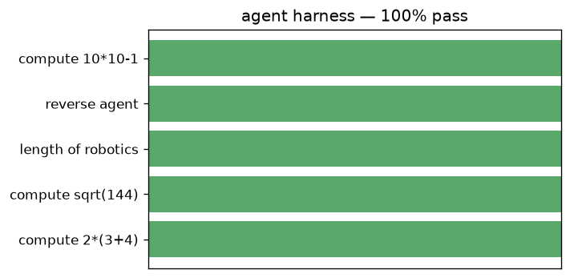

# Agent + tool-use harness

A reusable harness: a tool registry, a tool-using agent loop, a task suite, and a scorer.

Trained from scratch in **[Ropedia Academy](https://chaoyue0307.github.io/ropedia-academy/)** — an interactive, bilingual course on embodied & spatial AI. **Educational model:** small and quick to train; the value is the *method* and a reproducible pipeline, not a leaderboard score.

| | |
|---|---|
| **Task** | agent evaluation |
| **Data** | tool-use task suite |
| **Track** | AG · Agents & RL |
| **Notebook** | [](https://colab.research.google.com/github/ChaoYue0307/ropedia-academy/blob/main/notebooks/training/AG_agent_harness.ipynb) |

## Dataset

- **Name:** Tool-use task suite
- **Type:** synthetic — procedural
- **Size / stats:** 5 graded tasks (arithmetic + string ops) with ground-truth answers
- **Split:** eval suite
- **Source:** procedural

## Results

| metric | value |
|---|---|
| success_rate | 1.0 |




## How to use

```python
import torch
state = torch.load("model.pt", map_location="cpu")   # some labs save pose.pt / gaussians.pt / transform.pt
# Rebuild the model class from the Ropedia Academy notebook (linked above), then:
# model.load_state_dict(state)
```

## Files

- `figure.png`
- `results.json`


## Reproduce / train your own

Open the [lab notebook in Colab](https://colab.research.google.com/github/ChaoYue0307/ropedia-academy/blob/main/notebooks/training/AG_agent_harness.ipynb) → **Runtime → GPU → Run all**, then its *Publish to the Hugging Face Hub* cell. Browse every lab in the [Ropedia Academy Labs tab](https://chaoyue0307.github.io/ropedia-academy/labs).


---
*Part of the [Ropedia Academy](https://chaoyue0307.github.io/ropedia-academy/) trained-model collection.*
