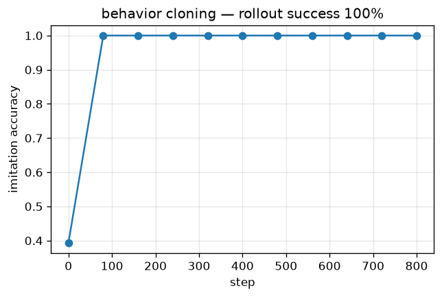

# Behavior cloning (imitation)

> A policy trained by supervised imitation of expert demonstrations; 100% rollout success.

Trained from scratch in **[Ropedia Academy](https://chaoyue0307.github.io/ropedia-academy/)** — an interactive, bilingual course on embodied & spatial AI. **Educational model:** small and quick to train; the value is the *method* and a reproducible pipeline, not a leaderboard score. Try it live in the **[Ropedia demos Space](https://huggingface.co/spaces/cy0307/ropedia-demos)**.

## At a glance

| | |
|---|---|
| **Base model** | Trained **from scratch** (random initialization) — no pretrained base model. |
| **Task** | imitation learning |
| **Training objective** | **Supervised imitation** — cross-entropy of the expert's actions (behavior cloning). |
| **Track** | AG · Agents & RL |
| **Notebook** | [](https://colab.research.google.com/github/ChaoYue0307/ropedia-academy/blob/main/notebooks/training/AG_behavior_cloning.ipynb) |

## Dataset

- **Name:** Expert gridworld demos
- **Type:** synthetic — procedural
- **Size / stats:** ~2,000 (state → expert action) pairs on a 6×6 grid (greedy expert)
- **Split:** train; eval = rollout success from every cell
- **Source:** procedural

## Training config

Adam (lr 3e-3), 800 steps; cross-entropy on ~2k expert (state→action) pairs; 6×6 grid.

## Evaluation results

| metric | value | meaning |
|---|---|---|
| `imitation_acc (final)` | 1.0 |  |
| `rollout_success` | 1.0 | fraction of start states from which the policy reaches the goal |




## Inference example

```python
import torch
state = torch.load("policy.pt", map_location="cpu")   # this repo's checkpoint
# Rebuild the exact module from the lab notebook (see "Reproduce"), then:
# model.load_state_dict(state); model.eval()
```

## Limitations

**Educational scale.** Trained quickly on CPU on small or synthetic data, so absolute numbers are not competitive with production systems — the value is the *method* and a reproducible pipeline. No large-scale data, no hyperparameter sweep, and no multi-seed variance is reported. **Not for production use.**

## Failure cases

Compounding error / distribution shift once it leaves the expert's states (no recovery) — needs DAgger to fix.

## Reproduce / train your own

**One click:** open the notebook in Colab → **Runtime → GPU → Run all**, then run its *Publish to the Hugging Face Hub* cell.

[](https://colab.research.google.com/github/ChaoYue0307/ropedia-academy/blob/main/notebooks/training/AG_behavior_cloning.ipynb)

**From a shell:**
```bash
git clone https://github.com/ChaoYue0307/ropedia-academy.git && cd ropedia-academy
pip install torch numpy matplotlib scikit-learn scikit-image gymnasium
jupyter nbconvert --to notebook --execute notebooks/training/AG_behavior_cloning.ipynb --output run.ipynb
# optional: override training length, e.g.  STEPS=2000  (or EPISODES=600)  before running
```

## Files

- `figure.png`
- `metrics.json`
- `policy.pt`


## License

Code & weights: **MIT** (this repository) — educational use encouraged.  
Data: generated procedurally in the notebook — no external dataset.

## Citation

If you use this model or the course materials, please cite:

```bibtex
@misc{ropedia_academy,
  title  = {Ropedia Academy: an interactive course on embodied & spatial AI},
  author = {Ropedia Academy},
  year   = {2026},
  howpublished = {\url{https://chaoyue0307.github.io/ropedia-academy/}}
}
```


**Method / original work:** Pomerleau, *ALVINN*, 1988; Ross et al., *DAgger*, AISTATS 2011.

## Related assets

- 🚀 **Live demos:** [https://huggingface.co/spaces/cy0307/ropedia-demos](https://huggingface.co/spaces/cy0307/ropedia-demos)
- 🤗 **All trained models + collection:** [https://huggingface.co/cy0307](https://huggingface.co/cy0307)
- 📚 **Course & all labs:** [https://chaoyue0307.github.io/ropedia-academy/](https://chaoyue0307.github.io/ropedia-academy/) · [Labs tab](https://chaoyue0307.github.io/ropedia-academy/labs)
- 💻 **Source / notebooks:** [github.com/ChaoYue0307/ropedia-academy](https://github.com/ChaoYue0307/ropedia-academy)


---
*Part of the [Ropedia Academy](https://chaoyue0307.github.io/ropedia-academy/) trained-model collection. Contributions & issues welcome on [GitHub](https://github.com/ChaoYue0307/ropedia-academy).*
