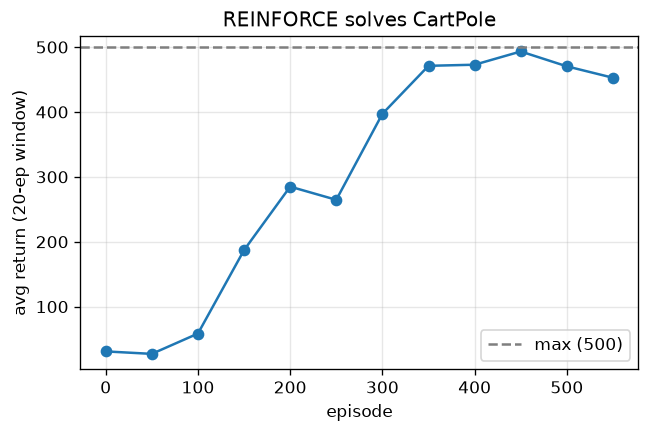

# REINFORCE / actor-critic (CartPole)

A policy-gradient agent with a value baseline + entropy bonus that solves the Gymnasium CartPole-v1 benchmark (greedy return near the 500 maximum).

Trained from scratch in **[Ropedia Academy](https://chaoyue0307.github.io/ropedia-academy/)** — an interactive, bilingual course on embodied & spatial AI. **Educational model:** small and quick to train; the value is the *method* and a reproducible pipeline, not a leaderboard score.

| | |
|---|---|
| **Task** | reinforcement learning |
| **Data** | Gymnasium CartPole-v1 |
| **Track** | AG · Agents & RL |
| **Notebook** | [](https://colab.research.google.com/github/ChaoYue0307/ropedia-academy/blob/main/notebooks/training/AG_reinforce_gridworld.ipynb) |

## Dataset

- **Name:** Gymnasium CartPole-v1
- **Type:** standard RL benchmark environment (no fixed dataset)
- **Size / stats:** 4-D continuous state, 2 discrete actions; reward +1/step, episode cap 500; agent learns from its own rollouts
- **Split:** online RL; greedy eval over 20 episodes
- **Source:** Gymnasium (Farama Foundation) CartPole-v1

## Results

| metric | value |
|---|---|
| return (final) | 452.7 |
| greedy_eval | 449.45 |




## How to use

```python
import torch
state = torch.load("model.pt", map_location="cpu")   # some labs save pose.pt / gaussians.pt / transform.pt
# Rebuild the model class from the Ropedia Academy notebook (linked above), then:
# model.load_state_dict(state)
```

## Files

- `figure.png`
- `metrics.json`
- `policy.pt`


## Reproduce / train your own

Open the [lab notebook in Colab](https://colab.research.google.com/github/ChaoYue0307/ropedia-academy/blob/main/notebooks/training/AG_reinforce_gridworld.ipynb) → **Runtime → GPU → Run all**, then its *Publish to the Hugging Face Hub* cell. Browse every lab in the [Ropedia Academy Labs tab](https://chaoyue0307.github.io/ropedia-academy/labs).


---
*Part of the [Ropedia Academy](https://chaoyue0307.github.io/ropedia-academy/) trained-model collection.*
