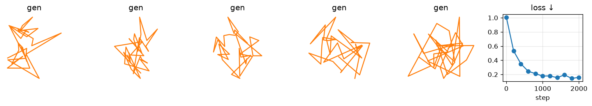

# Motion diffusion (DDPM)

A denoising-diffusion model that generates motion trajectories — the MDM recipe, trained from scratch, sampled from EMA weights.

Trained from scratch in **[Ropedia Academy](https://chaoyue0307.github.io/ropedia-academy/)** — an interactive, bilingual course on embodied & spatial AI. **Educational model:** small and quick to train; the value is the *method* and a reproducible pipeline, not a leaderboard score.

| | |
|---|---|
| **Task** | human-motion generation |
| **Data** | synthetic 2D motion trajectories |
| **Track** | A · Human modeling |
| **Notebook** | [](https://colab.research.google.com/github/ChaoYue0307/ropedia-academy/blob/main/notebooks/training/A_motion_diffusion.ipynb) |

## Results

| metric | value |
|---|---|
| loss (final) | 0.159 |




## How to use

```python
import torch
state = torch.load("model.pt", map_location="cpu")   # some labs save pose.pt / gaussians.pt / transform.pt
# Rebuild the model class from the Ropedia Academy notebook (linked above), then:
# model.load_state_dict(state)
```

## Files

- `denoiser.pt`
- `figure.png`
- `metrics.json`


## Reproduce / train your own

Open the [lab notebook in Colab](https://colab.research.google.com/github/ChaoYue0307/ropedia-academy/blob/main/notebooks/training/A_motion_diffusion.ipynb) → **Runtime → GPU → Run all**, then its *Publish to the Hugging Face Hub* cell. Browse every lab in the [Ropedia Academy Labs tab](https://chaoyue0307.github.io/ropedia-academy/labs).


---
*Part of the [Ropedia Academy](https://chaoyue0307.github.io/ropedia-academy/) trained-model collection.*
