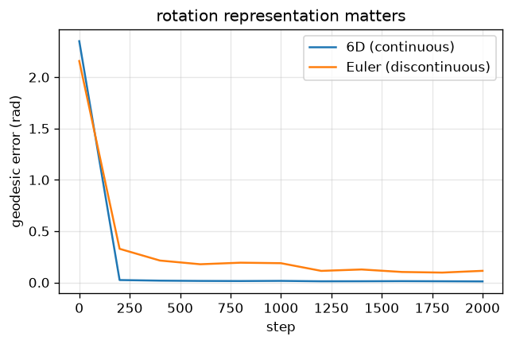

# 6D vs Euler rotation regression

Shows the continuous 6D rotation representation is far easier for a network to regress than Euler angles.

Trained from scratch in **[Ropedia Academy](https://chaoyue0307.github.io/ropedia-academy/)** — an interactive, bilingual course on embodied & spatial AI. **Educational model:** small and quick to train; the value is the *method* and a reproducible pipeline, not a leaderboard score.

| | |
|---|---|
| **Task** | 3D rotation regression |
| **Data** | random SO(3) rotations |
| **Track** | A · Human modeling |
| **Notebook** | [](https://colab.research.google.com/github/ChaoYue0307/ropedia-academy/blob/main/notebooks/training/A_rotation_6d.ipynb) |

## Dataset

- **Name:** Random SO(3) rotations
- **Type:** synthetic — procedural
- **Size / stats:** uniform rotations via random quaternions; input = rotation applied to 8 fixed 3D points (24-D); 256/batch
- **Split:** generative (infinite)
- **Source:** procedural

## Results

| metric | value |
|---|---|
| geo_6d (final) | 0.0126 |
| geo_euler (final) | 0.1313 |




## How to use

```python
import torch
state = torch.load("model.pt", map_location="cpu")   # some labs save pose.pt / gaussians.pt / transform.pt
# Rebuild the model class from the Ropedia Academy notebook (linked above), then:
# model.load_state_dict(state)
```

## Files

- `figure.png`
- `metrics.json`
- `rot6d.pt`


## Reproduce / train your own

Open the [lab notebook in Colab](https://colab.research.google.com/github/ChaoYue0307/ropedia-academy/blob/main/notebooks/training/A_rotation_6d.ipynb) → **Runtime → GPU → Run all**, then its *Publish to the Hugging Face Hub* cell. Browse every lab in the [Ropedia Academy Labs tab](https://chaoyue0307.github.io/ropedia-academy/labs).


---
*Part of the [Ropedia Academy](https://chaoyue0307.github.io/ropedia-academy/) trained-model collection.*
