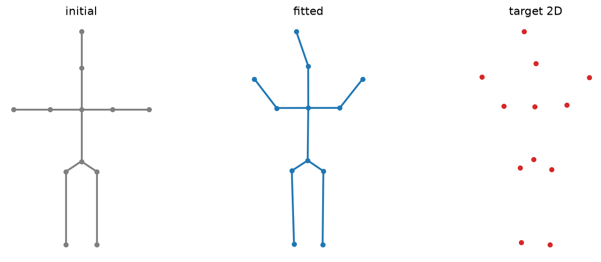

# SMPLify body fit

An articulated body fit to 2D keypoints by reprojection optimization with a pose prior — the SMPLify recipe.

Trained from scratch in **[Ropedia Academy](https://chaoyue0307.github.io/ropedia-academy/)** — an interactive, bilingual course on embodied & spatial AI. **Educational model:** small and quick to train; the value is the *method* and a reproducible pipeline, not a leaderboard score.

| | |
|---|---|
| **Task** | 3D human pose by 2D-keypoint reprojection |
| **Data** | synthetic 2D keypoints |
| **Track** | A · Human modeling |
| **Notebook** | [](https://colab.research.google.com/github/ChaoYue0307/ropedia-academy/blob/main/notebooks/training/A_smplify_fit.ipynb) |

## Dataset

- **Name:** Synthetic 2D keypoints
- **Type:** synthetic — procedural, generated in the notebook
- **Size / stats:** 1 articulated skeleton (12 joints) → 12 projected 2D keypoints + Gaussian noise
- **Split:** single instance (per-image optimization)
- **Source:** procedural

## Results

| metric | value |
|---|---|
| reproj (final) | 0.0001 |




## How to use

```python
import torch
state = torch.load("model.pt", map_location="cpu")   # some labs save pose.pt / gaussians.pt / transform.pt
# Rebuild the model class from the Ropedia Academy notebook (linked above), then:
# model.load_state_dict(state)
```

## Files

- `figure.png`
- `metrics.json`
- `pose.pt`


## Reproduce / train your own

Open the [lab notebook in Colab](https://colab.research.google.com/github/ChaoYue0307/ropedia-academy/blob/main/notebooks/training/A_smplify_fit.ipynb) → **Runtime → GPU → Run all**, then its *Publish to the Hugging Face Hub* cell. Browse every lab in the [Ropedia Academy Labs tab](https://chaoyue0307.github.io/ropedia-academy/labs).


---
*Part of the [Ropedia Academy](https://chaoyue0307.github.io/ropedia-academy/) trained-model collection.*
