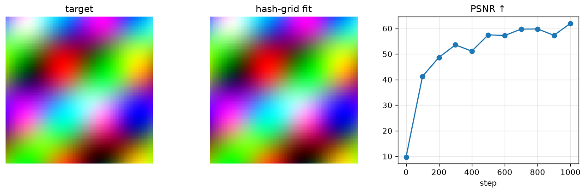

# Multiresolution hash grid (Instant-NGP)

> A multiresolution hash-grid feature encoding + tiny MLP that fits a real photograph to high PSNR — the trick that made NeRF ~1000× faster.

Trained from scratch in **[Ropedia Academy](https://chaoyue0307.github.io/ropedia-academy/)** — an interactive, bilingual course on embodied & spatial AI. **Educational model:** small and quick to train; the value is the *method* and a reproducible pipeline, not a leaderboard score. Try it live in the **[Ropedia demos Space](https://huggingface.co/spaces/cy0307/ropedia-demos)**.

## At a glance

| | |
|---|---|
| **Base model** | Trained **from scratch** (random initialization) — no pretrained base model. |
| **Task** | differentiable image fitting |
| **Training objective** | **Photometric L2** image fitting through a multiresolution **hash-grid** encoding + a tiny MLP. |
| **Track** | B · 3D & rendering |
| **Notebook** | [](https://colab.research.google.com/github/ChaoYue0307/ropedia-academy/blob/main/notebooks/training/B_hashgrid_instngp.ipynb) |

## Dataset

- **Name:** Real photograph (astronaut)
- **Type:** real — public-domain image
- **Size / stats:** 1 RGB photo resized to 96×96; 8-level hash grid (2^14 entries/level)
- **Split:** single image (overfit)
- **Source:** scikit-image data.astronaut() (NASA, public domain)

## Training config

Adam (lr 1e-2), 1500 steps; 8-level hash grid (2¹⁴ entries × 2 feats/level) + 2-layer MLP; 96×96.

## Evaluation results

| metric | value | meaning |
|---|---|---|
| `psnr (final)` | 64.25 |  |




## Inference example

```python
import torch
state = torch.load("hashgrid.pt", map_location="cpu")   # this repo's checkpoint
# Rebuild the exact module from the lab notebook (see "Reproduce"), then:
# model.load_state_dict(state); model.eval()
```

## Limitations

**Educational scale.** Trained quickly on CPU on small or synthetic data, so absolute numbers are not competitive with production systems — the value is the *method* and a reproducible pipeline. No large-scale data, no hyperparameter sweep, and no multi-seed variance is reported. **Not for production use.**

Overfits a **single image**; hash collisions limit the highest-frequency detail; PSNR is generous on smooth images.

## Failure cases

Hash collisions cause speckle at the finest levels; fitting succeeds on one image but says nothing about others.

## Reproduce / train your own

**One click:** open the notebook in Colab → **Runtime → GPU → Run all**, then run its *Publish to the Hugging Face Hub* cell.

[](https://colab.research.google.com/github/ChaoYue0307/ropedia-academy/blob/main/notebooks/training/B_hashgrid_instngp.ipynb)

**From a shell:**
```bash
git clone https://github.com/ChaoYue0307/ropedia-academy.git && cd ropedia-academy
pip install torch numpy matplotlib scikit-learn scikit-image gymnasium
jupyter nbconvert --to notebook --execute notebooks/training/B_hashgrid_instngp.ipynb --output run.ipynb
# optional: override training length, e.g.  STEPS=2000  (or EPISODES=600)  before running
```

## Files

- `figure.png`
- `hashgrid.pt`
- `metrics.json`


## License

Code & weights: **MIT** (this repository) — educational use encouraged.  
Image: *astronaut* test image (NASA) — public domain, shipped with scikit-image.

## Citation

If you use this model or the course materials, please cite:

```bibtex
@misc{ropedia_academy,
  title  = {Ropedia Academy: an interactive course on embodied & spatial AI},
  author = {Ropedia Academy},
  year   = {2026},
  howpublished = {\url{https://chaoyue0307.github.io/ropedia-academy/}}
}
```


**Method / original work:** Müller et al., *Instant Neural Graphics Primitives (Instant-NGP)*, SIGGRAPH 2022.

## Related assets

- 🚀 **Live demos:** [https://huggingface.co/spaces/cy0307/ropedia-demos](https://huggingface.co/spaces/cy0307/ropedia-demos)
- 🤗 **All trained models + collection:** [https://huggingface.co/cy0307](https://huggingface.co/cy0307)
- 📚 **Course & all labs:** [https://chaoyue0307.github.io/ropedia-academy/](https://chaoyue0307.github.io/ropedia-academy/) · [Labs tab](https://chaoyue0307.github.io/ropedia-academy/labs)
- 💻 **Source / notebooks:** [github.com/ChaoYue0307/ropedia-academy](https://github.com/ChaoYue0307/ropedia-academy)


---
*Part of the [Ropedia Academy](https://chaoyue0307.github.io/ropedia-academy/) trained-model collection. Contributions & issues welcome on [GitHub](https://github.com/ChaoYue0307/ropedia-academy).*
