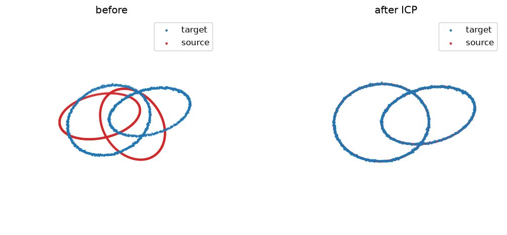

# ICP point-cloud registration

Recovers a rigid transform between two point clouds with Iterative Closest Point (nearest-neighbour + Kabsch).

Trained from scratch in **[Ropedia Academy](https://chaoyue0307.github.io/ropedia-academy/)** — an interactive, bilingual course on embodied & spatial AI. **Educational model:** small and quick to train; the value is the *method* and a reproducible pipeline, not a leaderboard score.

| | |
|---|---|
| **Task** | rigid point-cloud alignment |
| **Data** | synthetic 3D clouds |
| **Track** | B · 3D & rendering |
| **Notebook** | [](https://colab.research.google.com/github/ChaoYue0307/ropedia-academy/blob/main/notebooks/training/B_icp_registration.ipynb) |

## Dataset

- **Name:** Synthetic point clouds
- **Type:** synthetic — procedural
- **Size / stats:** two linked rings (~800 points, 3-D); target = source under a known rigid transform + 0.01 noise
- **Split:** 1 source/target pair
- **Source:** procedural

## Results

| metric | value |
|---|---|
| rmse (final) | 0.0124 |




## How to use

```python
import torch
state = torch.load("model.pt", map_location="cpu")   # some labs save pose.pt / gaussians.pt / transform.pt
# Rebuild the model class from the Ropedia Academy notebook (linked above), then:
# model.load_state_dict(state)
```

## Files

- `figure.png`
- `metrics.json`
- `transform.pt`


## Reproduce / train your own

Open the [lab notebook in Colab](https://colab.research.google.com/github/ChaoYue0307/ropedia-academy/blob/main/notebooks/training/B_icp_registration.ipynb) → **Runtime → GPU → Run all**, then its *Publish to the Hugging Face Hub* cell. Browse every lab in the [Ropedia Academy Labs tab](https://chaoyue0307.github.io/ropedia-academy/labs).


---
*Part of the [Ropedia Academy](https://chaoyue0307.github.io/ropedia-academy/) trained-model collection.*
