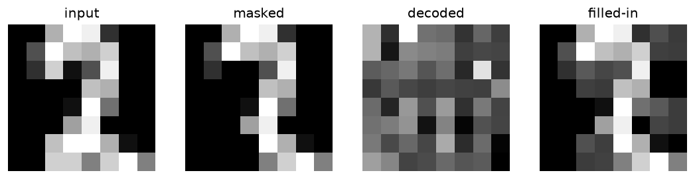

# Masked Autoencoder (MAE)

Masks half the image patches and reconstructs them on real handwritten digits — the MAE / VideoMAE pretraining objective; reports held-out reconstruction error.

Trained from scratch in **[Ropedia Academy](https://chaoyue0307.github.io/ropedia-academy/)** — an interactive, bilingual course on embodied & spatial AI. **Educational model:** small and quick to train; the value is the *method* and a reproducible pipeline, not a leaderboard score.

| | |
|---|---|
| **Task** | self-supervised pretraining |
| **Data** | real handwritten digits (sklearn) |
| **Track** | B · 3D & rendering |
| **Notebook** | [](https://colab.research.google.com/github/ChaoYue0307/ropedia-academy/blob/main/notebooks/training/B_mae_pretrain.ipynb) |

## Dataset

- **Name:** Handwritten digits (UCI / scikit-learn)
- **Type:** real — public dataset
- **Size / stats:** 1,797 real 8×8 grayscale digit images; 16 patches of 2×2, 50% masked; 128/batch
- **Split:** 1,257 train / 540 test (held-out reconstruction)
- **Source:** scikit-learn load_digits (UCI Optical Recognition of Handwritten Digits)

## Results

| metric | value |
|---|---|
| recon_mse (final) | 0.1393 |
| test_recon_mse | 0.1365 |




## How to use

```python
import torch
state = torch.load("model.pt", map_location="cpu")   # some labs save pose.pt / gaussians.pt / transform.pt
# Rebuild the model class from the Ropedia Academy notebook (linked above), then:
# model.load_state_dict(state)
```

## Files

- `figure.png`
- `mae.pt`
- `metrics.json`


## Reproduce / train your own

Open the [lab notebook in Colab](https://colab.research.google.com/github/ChaoYue0307/ropedia-academy/blob/main/notebooks/training/B_mae_pretrain.ipynb) → **Runtime → GPU → Run all**, then its *Publish to the Hugging Face Hub* cell. Browse every lab in the [Ropedia Academy Labs tab](https://chaoyue0307.github.io/ropedia-academy/labs).


---
*Part of the [Ropedia Academy](https://chaoyue0307.github.io/ropedia-academy/) trained-model collection.*
