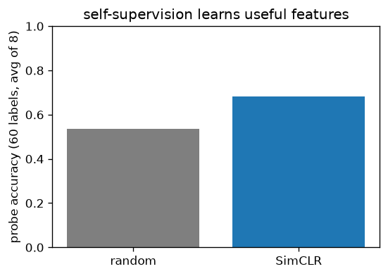
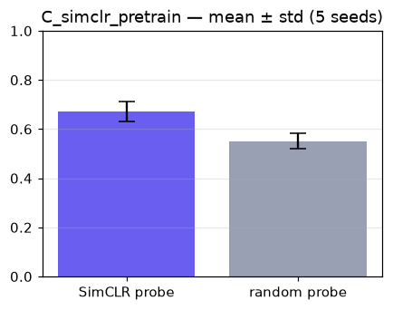

# SimCLR self-supervised pretraining

> Contrastive (NT-Xent) pretraining on real handwritten digits with a large batch; a few-shot linear probe on the frozen features beats a random encoder on held-out digits.

Trained from scratch in **[Ropedia Academy](https://chaoyue0307.github.io/ropedia-academy/)** — an interactive, bilingual course on embodied & spatial AI. **Educational model:** small and quick to train; the value is the *method* and a reproducible pipeline, not a leaderboard score. Try it live in the **[Ropedia demos Space](https://huggingface.co/spaces/cy0307/ropedia-demos)**.

## At a glance

| | |
|---|---|
| **Base model** | Trained **from scratch** (random initialization) — no pretrained base model. |
| **Task** | contrastive representation learning |
| **Training objective** | **NT-Xent contrastive loss** on two augmented views; a frozen linear probe measures the learned features. |
| **Track** | C · Egocentric vision |
| **Notebook** | [](https://colab.research.google.com/github/ChaoYue0307/ropedia-academy/blob/main/notebooks/training/C_simclr_pretrain.ipynb) |

## Dataset

- **Name:** Handwritten digits (UCI / scikit-learn)
- **Type:** real — public dataset
- **Size / stats:** 1,797 real 8×8 digit images, 10 classes; 256/batch contrastive (unlabeled); probe = 60 labels, averaged over 8 random subsets / 540 test
- **Split:** 1,257 train / 540 test; few-shot linear probe
- **Source:** scikit-learn load_digits (UCI Optical Recognition of Handwritten Digits)

## Training config

Adam (lr 1.5e-3, cosine), 2500 steps, batch 256; NT-Xent τ=0.5; proj 64→128→64 + light cutout. Probe: 60 labels, averaged over 8 subsets (Adam lr 1e-2).

## Evaluation results

| metric | value | meaning |
|---|---|---|
| `nt_xent (final)` | 5.412 |  |
| `probe_simclr` | 0.6826 | few-shot linear-probe accuracy (60 labels, avg of 8 subsets) on held-out digits — higher = better |
| `probe_random` | 0.5343 | same probe on an untrained encoder — the baseline SimCLR must beat |




## Robustness (mean ± std over 5 seeds)

Single-run numbers above are one seed; this is the distribution over independent re-trains (honest variance — no cherry-picking).


| metric | mean ± std |
|---|---|
| `probe_simclr` | 0.6705 ± 0.04 |
| `probe_random` | 0.5517 ± 0.031 |




## Inference example

```python
import torch, torch.nn as nn
enc = nn.Sequential(nn.Conv2d(1,32,3,1,1), nn.ReLU(), nn.MaxPool2d(2),
                    nn.Conv2d(32,64,3,1,1), nn.ReLU(), nn.AdaptiveAvgPool2d(1), nn.Flatten())
enc.load_state_dict(torch.load("encoder.pt", map_location="cpu")); enc.eval()
# images: (N,1,8,8) float in [0,1]  ->  features = enc(images)   # (N, 64)
```

## Limitations

**Educational scale.** Trained quickly on CPU on small or synthetic data, so absolute numbers are not competitive with production systems — the value is the *method* and a reproducible pipeline. No large-scale data, no hyperparameter sweep, and no multi-seed variance is reported. **Not for production use.**

Features are learned on **8×8 digits** — they will not transfer to natural images; needs a large batch to work.

## Failure cases

Wrong augmentations (e.g. horizontal flips on digits) destroy the signal; collapses with too-weak/too-strong augmentation.

## Reproduce / train your own

**One click:** open the notebook in Colab → **Runtime → GPU → Run all**, then run its *Publish to the Hugging Face Hub* cell.

[](https://colab.research.google.com/github/ChaoYue0307/ropedia-academy/blob/main/notebooks/training/C_simclr_pretrain.ipynb)

**From a shell:**
```bash
git clone https://github.com/ChaoYue0307/ropedia-academy.git && cd ropedia-academy
pip install torch numpy matplotlib scikit-learn scikit-image gymnasium
jupyter nbconvert --to notebook --execute notebooks/training/C_simclr_pretrain.ipynb --output run.ipynb
# optional: override training length, e.g.  STEPS=2000  (or EPISODES=600)  before running
```

## Files

- `encoder.pt`
- `figure.png`
- `metrics.json`
- `seeds.png`


## License

Code & weights: **MIT** (this repository) — educational use encouraged.  
Handwritten-digits data: UCI ML Repository via scikit-learn — CC BY 4.0.

## Citation

If you use this model or the course materials, please cite:

```bibtex
@misc{ropedia_academy,
  title  = {Ropedia Academy: an interactive course on embodied & spatial AI},
  author = {Ropedia Academy},
  year   = {2026},
  howpublished = {\url{https://chaoyue0307.github.io/ropedia-academy/}}
}
```


**Method / original work:** Chen et al., *A Simple Framework for Contrastive Learning (SimCLR)*, ICML 2020.

## Related assets

- 🚀 **Live demos:** [https://huggingface.co/spaces/cy0307/ropedia-demos](https://huggingface.co/spaces/cy0307/ropedia-demos)
- 🤗 **All trained models + collection:** [https://huggingface.co/cy0307](https://huggingface.co/cy0307)
- 📚 **Course & all labs:** [https://chaoyue0307.github.io/ropedia-academy/](https://chaoyue0307.github.io/ropedia-academy/) · [Labs tab](https://chaoyue0307.github.io/ropedia-academy/labs)
- 💻 **Source / notebooks:** [github.com/ChaoYue0307/ropedia-academy](https://github.com/ChaoYue0307/ropedia-academy)


---
*Part of the [Ropedia Academy](https://chaoyue0307.github.io/ropedia-academy/) trained-model collection. Contributions & issues welcome on [GitHub](https://github.com/ChaoYue0307/ropedia-academy).*
