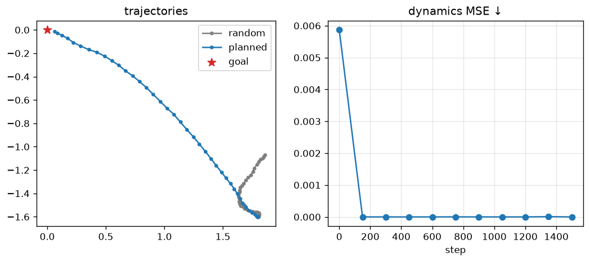

# World model + planning (CEM)

> Learns environment dynamics, then plans with the Cross-Entropy Method to reach a goal inside imagination.

Trained from scratch in **[Ropedia Academy](https://chaoyue0307.github.io/ropedia-academy/)** — an interactive, bilingual course on embodied & spatial AI. **Educational model:** small and quick to train; the value is the *method* and a reproducible pipeline, not a leaderboard score. Try it live in the **[Ropedia demos Space](https://huggingface.co/spaces/cy0307/ropedia-demos)**.

## At a glance

| | |
|---|---|
| **Base model** | Trained **from scratch** (random initialization) — no pretrained base model. |
| **Task** | model-based control |
| **Training objective** | Supervised **one-step dynamics** prediction (MSE); planning by the **Cross-Entropy Method (CEM)**. |
| **Track** | D · Scene & world models |
| **Notebook** | [](https://colab.research.google.com/github/ChaoYue0307/ropedia-academy/blob/main/notebooks/training/D_world_model.ipynb) |

## Dataset

- **Name:** 2D point-mass rollouts
- **Type:** synthetic — procedural env
- **Size / stats:** 60,000 transitions (3,000 random starts × 20 steps); state 4-D [x,y,vx,vy], action 2-D
- **Split:** train only
- **Source:** procedural env

## Training config

Adam (lr 1e-3), 1500 steps for the dynamics model; planning by Cross-Entropy Method (CEM).

## Evaluation results

| metric | value | meaning |
|---|---|---|
| `dyn_mse (final)` | 0.0 |  |
| `final_dist.planner` | 0.0062 |  |
| `final_dist.random` | 2.169 |  |




## Inference example

```python
import torch
state = torch.load("dynamics.pt", map_location="cpu")   # this repo's checkpoint
# Rebuild the exact module from the lab notebook (see "Reproduce"), then:
# model.load_state_dict(state); model.eval()
```

## Limitations

**Educational scale.** Trained quickly on CPU on small or synthetic data, so absolute numbers are not competitive with production systems — the value is the *method* and a reproducible pipeline. No large-scale data, no hyperparameter sweep, and no multi-seed variance is reported. **Not for production use.**

Single 2D point-mass; one-step model errors compound over long horizons.

## Failure cases

CEM plans poorly when the learned model is queried off-distribution; errors compound over the horizon.

## Reproduce / train your own

**One click:** open the notebook in Colab → **Runtime → GPU → Run all**, then run its *Publish to the Hugging Face Hub* cell.

[](https://colab.research.google.com/github/ChaoYue0307/ropedia-academy/blob/main/notebooks/training/D_world_model.ipynb)

**From a shell:**
```bash
git clone https://github.com/ChaoYue0307/ropedia-academy.git && cd ropedia-academy
pip install torch numpy matplotlib scikit-learn scikit-image gymnasium
jupyter nbconvert --to notebook --execute notebooks/training/D_world_model.ipynb --output run.ipynb
# optional: override training length, e.g.  STEPS=2000  (or EPISODES=600)  before running
```

## Files

- `dynamics.pt`
- `figure.png`
- `metrics.json`


## License

Code & weights: **MIT** (this repository) — educational use encouraged.  
Data: generated procedurally in the notebook — no external dataset.

## Citation

If you use this model or the course materials, please cite:

```bibtex
@misc{ropedia_academy,
  title  = {Ropedia Academy: an interactive course on embodied & spatial AI},
  author = {Ropedia Academy},
  year   = {2026},
  howpublished = {\url{https://chaoyue0307.github.io/ropedia-academy/}}
}
```


**Method / original work:** Ha & Schmidhuber, *World Models*, NeurIPS 2018; Rubinstein, *The Cross-Entropy Method*, 1999.

## Related assets

- 🚀 **Live demos:** [https://huggingface.co/spaces/cy0307/ropedia-demos](https://huggingface.co/spaces/cy0307/ropedia-demos)
- 🤗 **All trained models + collection:** [https://huggingface.co/cy0307](https://huggingface.co/cy0307)
- 📚 **Course & all labs:** [https://chaoyue0307.github.io/ropedia-academy/](https://chaoyue0307.github.io/ropedia-academy/) · [Labs tab](https://chaoyue0307.github.io/ropedia-academy/labs)
- 💻 **Source / notebooks:** [github.com/ChaoYue0307/ropedia-academy](https://github.com/ChaoYue0307/ropedia-academy)


---
*Part of the [Ropedia Academy](https://chaoyue0307.github.io/ropedia-academy/) trained-model collection. Contributions & issues welcome on [GitHub](https://github.com/ChaoYue0307/ropedia-academy).*
