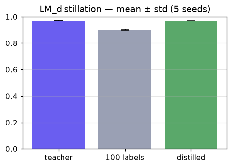

# Knowledge distillation

> On real handwritten digits, a small student trained on a teacher's soft predictions over all data nearly matches the teacher and beats one trained on only a few hard labels.

Trained from scratch in **[Ropedia Academy](https://chaoyue0307.github.io/ropedia-academy/)** — an interactive, bilingual course on embodied & spatial AI. **Educational model:** small and quick to train; the value is the *method* and a reproducible pipeline, not a leaderboard score. Try it live in the **[Ropedia demos Space](https://huggingface.co/spaces/cy0307/ropedia-demos)**.

## At a glance

| | |
|---|---|
| **Base model** | Trained **from scratch** (random initialization) — no pretrained base model. |
| **Task** | model compression |
| **Training objective** | **Knowledge distillation** — KL between student and teacher softened logits at temperature T. |
| **Track** | LM · Language & models |
| **Notebook** | [](https://colab.research.google.com/github/ChaoYue0307/ropedia-academy/blob/main/notebooks/training/LM_distillation.ipynb) |

## Dataset

- **Name:** Handwritten digits (UCI / scikit-learn)
- **Type:** real — public dataset
- **Size / stats:** 1,797 real 8×8 digit images (64-D), 10 classes; the plain student sees only 100 labels, the distilled one learns from the teacher's soft targets over all 1,257
- **Split:** 1,257 train / 540 test
- **Source:** scikit-learn load_digits (UCI Optical Recognition of Handwritten Digits)

## Training config

Teacher: Adam (lr 2e-3), 800 steps. Student: Adam (lr 3e-3), 1500 steps; KL distillation at T=4 (loss ×16).

## Evaluation results

| metric | value | meaning |
|---|---|---|
| `teacher` | 0.9704 | teacher test accuracy on held-out digits |
| `student_plain (final)` | 0.9056 |  |
| `student_distill (final)` | 0.9685 |  |


## Robustness (mean ± std over 5 seeds)

Single-run numbers above are one seed; this is the distribution over independent re-trains (honest variance — no cherry-picking).


| metric | mean ± std |
|---|---|
| `teacher` | 0.9707 ± 0.0018 |
| `student_plain` | 0.9 ± 0.0026 |
| `student_distill` | 0.9681 ± 0.003 |




## Inference example

```python
import torch, torch.nn as nn
teacher = nn.Sequential(nn.Linear(64,256), nn.ReLU(), nn.Linear(256,256), nn.ReLU(), nn.Linear(256,10))
teacher.load_state_dict(torch.load("teacher.pt", map_location="cpu")); teacher.eval()
# x: flattened 8x8 digit /16.0, shape (N,64)  ->  logits = teacher(x); pred = logits.argmax(-1)
```

## Limitations

**Educational scale.** Trained quickly on CPU on small or synthetic data, so absolute numbers are not competitive with production systems — the value is the *method* and a reproducible pipeline. No large-scale data, no hyperparameter sweep, and no multi-seed variance is reported. **Not for production use.**

On **8×8 digits**; the gain shrinks if the task is easy or the student is large; sensitive to temperature.

## Failure cases

No benefit if the task is too easy or the student is already big enough; a wrong temperature washes out or over-sharpens the soft targets.

## Reproduce / train your own

**One click:** open the notebook in Colab → **Runtime → GPU → Run all**, then run its *Publish to the Hugging Face Hub* cell.

[](https://colab.research.google.com/github/ChaoYue0307/ropedia-academy/blob/main/notebooks/training/LM_distillation.ipynb)

**From a shell:**
```bash
git clone https://github.com/ChaoYue0307/ropedia-academy.git && cd ropedia-academy
pip install torch numpy matplotlib scikit-learn scikit-image gymnasium
jupyter nbconvert --to notebook --execute notebooks/training/LM_distillation.ipynb --output run.ipynb
# optional: override training length, e.g.  STEPS=2000  (or EPISODES=600)  before running
```

## Files

- `figure.png`
- `metrics.json`
- `seeds.png`
- `teacher.pt`


## License

Code & weights: **MIT** (this repository) — educational use encouraged.  
Handwritten-digits data: UCI ML Repository via scikit-learn — CC BY 4.0.

## Citation

If you use this model or the course materials, please cite:

```bibtex
@misc{ropedia_academy,
  title  = {Ropedia Academy: an interactive course on embodied & spatial AI},
  author = {Ropedia Academy},
  year   = {2026},
  howpublished = {\url{https://chaoyue0307.github.io/ropedia-academy/}}
}
```


**Method / original work:** Hinton, Vinyals & Dean, *Distilling the Knowledge in a Neural Network*, NeurIPS-W 2015.

## Related assets

- 🚀 **Live demos:** [https://huggingface.co/spaces/cy0307/ropedia-demos](https://huggingface.co/spaces/cy0307/ropedia-demos)
- 🤗 **All trained models + collection:** [https://huggingface.co/cy0307](https://huggingface.co/cy0307)
- 📚 **Course & all labs:** [https://chaoyue0307.github.io/ropedia-academy/](https://chaoyue0307.github.io/ropedia-academy/) · [Labs tab](https://chaoyue0307.github.io/ropedia-academy/labs)
- 💻 **Source / notebooks:** [github.com/ChaoYue0307/ropedia-academy](https://github.com/ChaoYue0307/ropedia-academy)


---
*Part of the [Ropedia Academy](https://chaoyue0307.github.io/ropedia-academy/) trained-model collection. Contributions & issues welcome on [GitHub](https://github.com/ChaoYue0307/ropedia-academy).*
