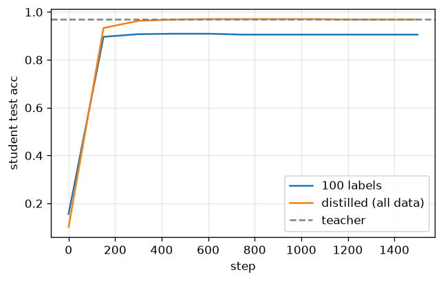

# Knowledge distillation

On real handwritten digits, a small student trained on a teacher's soft predictions over all data nearly matches the teacher and beats one trained on only a few hard labels.

Trained from scratch in **[Ropedia Academy](https://chaoyue0307.github.io/ropedia-academy/)** — an interactive, bilingual course on embodied & spatial AI. **Educational model:** small and quick to train; the value is the *method* and a reproducible pipeline, not a leaderboard score.

| | |
|---|---|
| **Task** | model compression |
| **Data** | real handwritten digits (sklearn) |
| **Track** | LM · Language & models |
| **Notebook** | [](https://colab.research.google.com/github/ChaoYue0307/ropedia-academy/blob/main/notebooks/training/LM_distillation.ipynb) |

## Dataset

- **Name:** Handwritten digits (UCI / scikit-learn)
- **Type:** real — public dataset
- **Size / stats:** 1,797 real 8×8 digit images (64-D), 10 classes; the plain student sees only 100 labels, the distilled one learns from the teacher's soft targets over all 1,257
- **Split:** 1,257 train / 540 test
- **Source:** scikit-learn load_digits (UCI Optical Recognition of Handwritten Digits)

## Results

| metric | value |
|---|---|
| teacher | 0.9704 |
| student_plain (final) | 0.9056 |
| student_distill (final) | 0.9685 |




## How to use

```python
import torch
state = torch.load("model.pt", map_location="cpu")   # some labs save pose.pt / gaussians.pt / transform.pt
# Rebuild the model class from the Ropedia Academy notebook (linked above), then:
# model.load_state_dict(state)
```

## Files

- `figure.png`
- `metrics.json`
- `teacher.pt`


## Reproduce / train your own

Open the [lab notebook in Colab](https://colab.research.google.com/github/ChaoYue0307/ropedia-academy/blob/main/notebooks/training/LM_distillation.ipynb) → **Runtime → GPU → Run all**, then its *Publish to the Hugging Face Hub* cell. Browse every lab in the [Ropedia Academy Labs tab](https://chaoyue0307.github.io/ropedia-academy/labs).


---
*Part of the [Ropedia Academy](https://chaoyue0307.github.io/ropedia-academy/) trained-model collection.*
