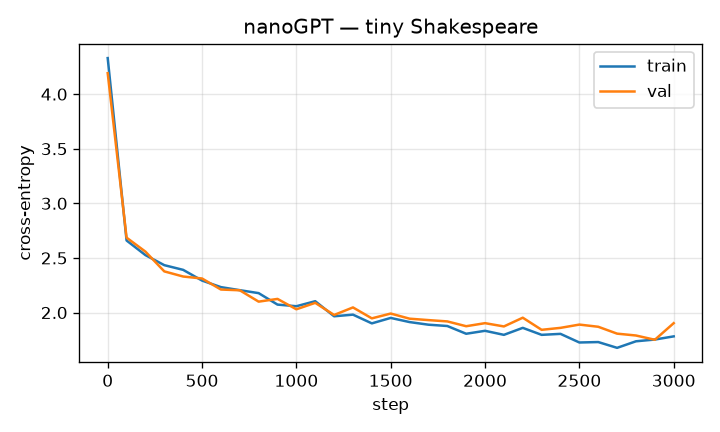

# nanoGPT — Tiny Shakespeare (Ropedia Academy)

A character-level GPT (decoder-only transformer) trained **from scratch** on Tiny Shakespeare — the nanoGPT lab from [Ropedia Academy](https://chaoyue0307.github.io/ropedia-academy/).

- **Params:** 0.82 M  |  **Config:** 4 layers, 4 heads, d=128, block=64
- **Final loss:** train 1.782 · val 1.903 (cross-entropy, 3000 steps, 354 s on CPU)
- **Tokenizer:** character-level, 65 chars (see `config.json`)

> Educational model (~1 MB of training text): it produces Shakespeare-flavoured characters, not coherent prose.

## Training loss



## Sample

```

Where?

WARWIS:
Skee, every, this much:
If your merrean and the doed. God,
When at restainot me that not are to Wast: if sto-leak
No stroy moth prosh horn of too desdo
Link of the ellone; this ever: the way that wan sake!
And juked, no be earry, his brade, 'Tis recoppinten
But commicking: is and sprages for pritter's the ease?

ISINIUS:

ESCAptizen, pasy grounder
Giver serens!' Let if my the that quan,
And parious earty:
not ugnhopain I would yet, that wint which shall with like
You have timed but his breing in the kneem
And encled aign and abond years was 'twonds:
Stre you nop to hear upard:
```

## Files
`model.pt` (weights) · `config.json` (arch + tokenizer) · `metrics.json` (loss history) · `sample.txt` · `loss.png`
