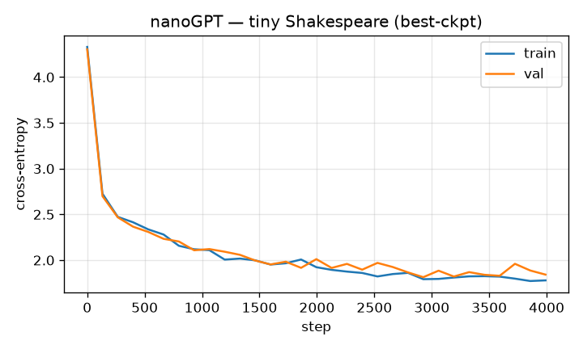

# nanoGPT — Tiny Shakespeare

> A character-level GPT (decoder-only transformer) trained from scratch; best-checkpoint by validation loss.

Trained from scratch in **[Ropedia Academy](https://chaoyue0307.github.io/ropedia-academy/)** — an interactive, bilingual course on embodied & spatial AI. **Educational model:** small and quick to train; the value is the *method* and a reproducible pipeline, not a leaderboard score. Try it live in the **[Ropedia demos Space](https://huggingface.co/spaces/cy0307/ropedia-demos)**.

## At a glance

| | |
|---|---|
| **Base model** | Trained **from scratch** (random initialization) — no pretrained base model. |
| **Task** | text-generation |
| **Training objective** | **Autoregressive next-token prediction** (cross-entropy); best checkpoint by validation loss. |
| **Track** | LM · Language & models |
| **Notebook** | [](https://colab.research.google.com/github/ChaoYue0307/ropedia-academy/blob/main/notebooks/training/LM_nanogpt_pretrain.ipynb) |

## Dataset

- **Name:** Tiny Shakespeare
- **Type:** real (public-domain text)
- **Size / stats:** 1,115,394 characters (~1.1 MB); 65-character vocabulary
- **Split:** 90% train / 10% val
- **Source:** https://github.com/karpathy/char-rnn (data/tinyshakespeare)

## Training config

AdamW (lr 3e-4, weight-decay 0.1), 3000 steps; char-level decoder-only transformer; best by val loss.

## Evaluation results

| metric | value | meaning |
|---|---|---|
| `history_step_train_val (final)` | 1.842 |  |
| `final_train` | 1.779 |  |
| `best_val` | 1.814 |  |
| `steps` | 4000 |  |
| `params` | 816705 |  |
| `train_seconds` | 505 |  |
| `config.block_size` | 64 |  |
| `config.n_embd` | 128 |  |
| `config.n_head` | 4 |  |
| `config.n_layer` | 4 |  |
| `config.vocab` | 65 |  |




## Sample output

```

Ciegvate tumpot of Bad'ers
We narvervy sures toak hasing more,
This hous mad the dide to to the for for hard with to
IsSeet if love true;
Mught and how fath quear uppose? City hat.
My and main thou but staltany; him comblead.

LEUMIEN:
Charth eyet not, bath brans yoer
Where shat? I'll at har comen mort, thou gene.

FROMOK:
I shall even Romen of joysed
You kind indswaul'd with thou bakeng, with mell.

DUCIO:
My shall stalk you fall hear:
Mant shall In in brothere'y! prancer, best worde houm's afd it.

UCIIO!

GLINIUS:
Rell w, it?

Go ELIA:
Where.

HED VOLLOONT:
More, now he now of nather'd nev
```

## Inference example

```python
import torch
sd = torch.load("gpt.pt", map_location="cpu")   # decoder-only transformer weights
# Rebuild the GPT class + char vocab from the notebook (see "Reproduce"), then:
# model.load_state_dict(sd); model.eval()
# print(decode(model.generate(torch.zeros((1,1), dtype=torch.long), 500)[0].tolist()))
# (A pre-generated sample is included as sample.txt.)
```

## Limitations

**Educational scale.** Trained quickly on CPU on small or synthetic data, so absolute numbers are not competitive with production systems — the value is the *method* and a reproducible pipeline. No large-scale data, no hyperparameter sweep, and no multi-seed variance is reported. **Not for production use.**

Character-level and tiny → no long-range coherence; it imitates Shakespearean *style*, not meaning.

## Failure cases

Repetition, invented words, and no factual grounding — a small char-LM memorizes style, not content.

## Reproduce / train your own

**One click:** open the notebook in Colab → **Runtime → GPU → Run all**, then run its *Publish to the Hugging Face Hub* cell.

[](https://colab.research.google.com/github/ChaoYue0307/ropedia-academy/blob/main/notebooks/training/LM_nanogpt_pretrain.ipynb)

**From a shell:**
```bash
git clone https://github.com/ChaoYue0307/ropedia-academy.git && cd ropedia-academy
pip install torch numpy matplotlib scikit-learn scikit-image gymnasium
jupyter nbconvert --to notebook --execute notebooks/training/LM_nanogpt_pretrain.ipynb --output run.ipynb
# optional: override training length, e.g.  STEPS=2000  (or EPISODES=600)  before running
```

## Files

- `config.json`
- `figure.png`
- `metrics.json`
- `model.pt`
- `sample.txt`


## License

Code & weights: **MIT** (this repository) — educational use encouraged.  
Text: Tiny Shakespeare — public domain.

## Citation

If you use this model or the course materials, please cite:

```bibtex
@misc{ropedia_academy,
  title  = {Ropedia Academy: an interactive course on embodied & spatial AI},
  author = {Ropedia Academy},
  year   = {2026},
  howpublished = {\url{https://chaoyue0307.github.io/ropedia-academy/}}
}
```


**Method / original work:** Vaswani et al., *Attention Is All You Need*, NeurIPS 2017; Karpathy, *nanoGPT*.

## Related assets

- 🚀 **Live demos:** [https://huggingface.co/spaces/cy0307/ropedia-demos](https://huggingface.co/spaces/cy0307/ropedia-demos)
- 🤗 **All trained models + collection:** [https://huggingface.co/cy0307](https://huggingface.co/cy0307)
- 📚 **Course & all labs:** [https://chaoyue0307.github.io/ropedia-academy/](https://chaoyue0307.github.io/ropedia-academy/) · [Labs tab](https://chaoyue0307.github.io/ropedia-academy/labs)
- 💻 **Source / notebooks:** [github.com/ChaoYue0307/ropedia-academy](https://github.com/ChaoYue0307/ropedia-academy)


---
*Part of the [Ropedia Academy](https://chaoyue0307.github.io/ropedia-academy/) trained-model collection. Contributions & issues welcome on [GitHub](https://github.com/ChaoYue0307/ropedia-academy).*
